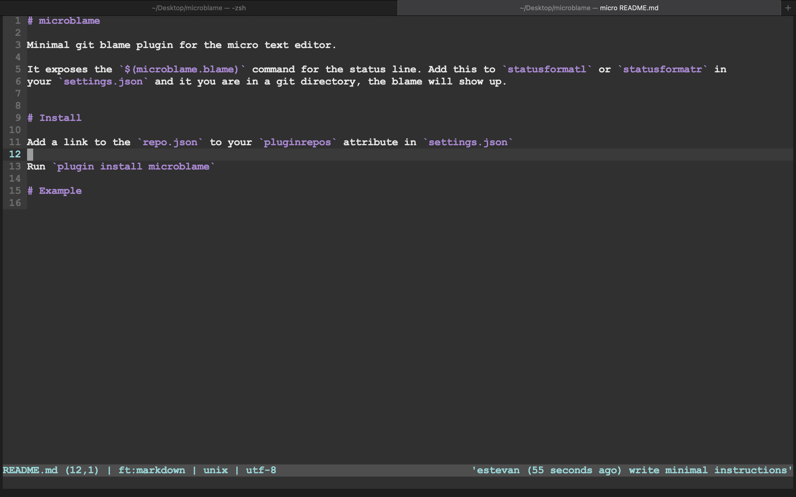

# microblame

Minimal git blame plugin for the micro text editor.

It exposes the `$(microblame.blame)` command for the status line. Add this to `statusformatl` or `statusformatr` in
your `settings.json` and if you are in a git directory, the blame will show up.

I don't think micro has a virtual text functionality, but if it ever gets integrated the next version will use
that instead of putting it in the status line.

# Install

Add a link to the `repo.json` to your `pluginrepos` attribute in `settings.json`

Run `plugin install microblame`

# Example

In this example, i added the `$(microblame.blame)` command to my `statusformatr` in `settings.json`

